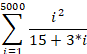

**C#.Net** **程序设计**

1. 变量标识符的命名规则：
   - 变量名应以**字母、下划线或@开头**，**后续可以包含字母、数字、下划线或@**。
   - 变量名不能与C#关键字冲突。
   - 建议使用有意义的名称，避免使用单个字符的变量名，除非在循环中作为计数器。
   - 遵循驼峰命名法（lowerCamelCase）或者帕斯卡命名法（UpperCamelCase），其中驼峰命名法用于局部变量和方法参数，帕斯卡命名法用于类名和属性名。

2. Convert类的使用：
   - Convert类提供了各种类型之间的转换方法，如**ToInt32**、**ToString**、**ToDouble**等。
   - 例如，将字符串转换为整数：int value = Convert.ToInt32("123");
   - 或者将整数转换为字符串：string strValue = Convert.ToString(123);

3. switch, for, while, foreach语句的使用：
   - switch语句用于根据一个表达式的值执行不同的代码块。例如：
     ```csharp
     int day = 5;
     switch (day)
     {
         case 1:
             Console.WriteLine("Monday");
             break;
         case 2:
             Console.WriteLine("Tuesday");
             break;
         // ...
     }
     ```
   - for语句用于执行特定次数的循环。例如：
     ```csharp
     for (int i = 0; i < 10; i++)
     {
         Console.WriteLine(i);
     }
     ```
   - while语句用于在满足某个条件时重复执行一段代码。例如：
     ```csharp
     int i = 0;
     while (i < 10)
     {
         Console.WriteLine(i);
         i++;
     }
     ```
   - foreach语句用于遍历集合中的元素。例如：
     ```csharp
     string[] days = { "Monday", "Tuesday", "Wednesday" };
     foreach (string day in days)
     {
         Console.WriteLine(day);
     }
     ```

4. break, continue语句的使用，i++ 和++i的区别；常用运算符的优先级：
   - break语句用于退出当前循环。
   - continue语句用于跳过当前循环的剩余部分并进入下一轮循环。
   - i++ 和++i都是自增运算符，它们都会使i的值增加1。但是，i++ 是先使用i的当前值，然后将其加1；而++i是先将i加1，然后使用新的值。
   - 常用运算符的优先级从高到低大致如下：()`[]` -> . -> ++/-- -> * / % -> + - -> << >> -> < > <= >= -> == != -> & -> ^ -> | -> && -> || -> ? : -> = += -= *= /= %= &= ^= |= <<= >>= -> ,

5. 异常的概念以及异常处理：try，catch，finally语句的意义及用法：
   - 异常是在程序运行过程中发生的错误或意外情况。
   - try/catch**语句用于捕获和处理异常**。try块包含可能抛出异常的代码，catch块则包含处理特定类型异常的代码。
   - finally块包含必须**在任何情况下都要执行的代码**，无论是否发生异常。
   - 例如：
     ```csharp
     try
     {
         // 可能抛出异常的代码
     }
     catch (Exception ex)
     {
         // 处理异常的代码
         Console.WriteLine($"An error occurred: {ex.Message}");
     }
     finally
     {
         // 必须执行的清理代码
         Console.WriteLine("Cleaning up...");
     }
     ```

6. 引用类型和值类型，它们的区别：
   - 值类型包括简单类型（如int、double、bool等）和结构体。值类型的变量直接存储其值，复制时会创建一个新的副本。
   - 引用类型包括类、接口、数组和委托。引用类型的变量存储的是对对象的引用（地址），复制时只是复制了引用，因此两个变量实际上指向同一个对象。
   - 主要区别在于：值类型变量直接包含其数据，而引用类型变量存储的是对数据的引用。值类型变量在赋值或传递给函数时会复制其值，而引用类型变量只会复制其引用。值类型通常更快，因为它们存储在栈上，而引用类型存储在堆上。

7. 一维数组和二维数组的用法：
   - 一维数组：一维数组是一个线性数据结构，元素按照顺序存储。
     ```csharp
     int[] numbers = new int[5]; // 创建一个长度为5的整数数组
     numbers[0] = 1; // 设置第一个元素的值
     Console.WriteLine(numbers[0]); // 输出第一个元素的值
     ```
   - 二维数组：二维数组是一个表格状的数据结构，元素按照行和列进行存储。
     ```csharp
     int[,] matrix = new int[3, 3]; // 创建一个3x3的整数矩阵
     matrix[0, 0] = 1; // 设置左上角元素的值
     Console.WriteLine(matrix[0, 0]); // 输出左上角元素的值
     ```

8. List<>泛型类的用法：
   - List<T>是C#中的一个泛型类，用于存储一组相同类型的对象。
     ```csharp
     List<int> numbers = new List<int>(); // 创建一个整数列表
     numbers.Add(1); // 添加一个元素
     numbers.Add(2);
     Console.WriteLine(numbers.Count); // 输出列表中元素的数量
     ```

9. String 类与 StringBuilder类的使用与区别：
   - String类：表示不可变的文本序列。每次修改String对象时，都会创建一个新的String对象。
     ```csharp
     string text = "Hello"; // 创建一个字符串
     text += " World"; // 这将创建一个新的字符串对象
     Console.WriteLine(text); // 输出："Hello World"
     ```
   - StringBuilder类：表示可变的文本序列。在修改StringBuilder对象时，不会每次都创建新的对象，因此在大量字符串操作中更高效。
     ```csharp
     StringBuilder sb = new StringBuilder("Hello"); // 创建一个字符串构建器
     sb.Append(" World"); // 这不会创建新的对象
     Console.WriteLine(sb.ToString()); // 输出："Hello World"
     ```

10. 静态方法和非静态方法的用法、区别：
    - 静态方法：属于类本身，不依赖于类的实例，通过类名直接调用。
      ```csharp
      public class MyClass
      {
          public static void MyStaticMethod()
          {
              Console.WriteLine("Static method called.");
          }
      }
      
      MyClass.MyStaticMethod(); // 直接通过类名调用静态方法
      ```
    - 非静态方法：属于类的实例，需要通过类的实例来调用。
      ```csharp
      public class MyClass
      {
          public void MyInstanceMethod()
          {
              Console.WriteLine("Instance method called.");
          }
      }
      
      MyClass myInstance = new MyClass();
      myInstance.MyInstanceMethod(); // 通过类的实例调用非静态方法
      ```

11. 类、基类、继承、抽象类、接口、委托、构造函数、重载、属性、多态的概念与用法：
    - 类：定义了一组相关属性和方法的模板。
    - 基类：一个类可以作为其他类的基类，被其他类继承。
    - 继承：一个类可以从一个或多个基类继承属性和方法。
    - 抽象类：不能实例化的类，只能被其他类继承。包含抽象方法（没有实现的方法）。
    - 接口：定义了一组方法签名，类可以实现接口来提供这些方法的实现。
    - 委托：表示对具有特定参数列表和返回类型的方法的引用。
    - 构造函数：在创建类的新实例时自动调用的方法，用于初始化对象的状态。
    - 重载：在同一类中定义多个同名但参数列表不同的方法。
    - 属性：封装了对字段的访问，提供了getter和setter方法来读取和设置字段的值。
    - 多态：允许将派生类的对象当作基类的对象来处理，从而实现代码的通用性和可扩展性。

12. TextBox、Button、RadioButton、CheckBox类的主要属性与用法：
    - TextBox：用于显示和编辑单行文本。
      主要属性：
        - Text：获取或设置文本框中显示的文本。
        - ReadOnly：确定文本框是否为只读。
    - Button：用于用户交互，通常在点击时触发某个事件。
      主要属性：
        - Text：获取或设置按钮上显示的文本。
        - Click：当用户单击按钮时引发的事件。
    - **RadioButton：用于提供一组互斥的选择项。**
      主要属性：
        - Text：获取或设置单选按钮上显示的文本。
        - Checked：确定单选按钮是否被选中。
    - **CheckBox：用于提供一组可以单独选择的选项。**
      主要属性：
        - Text：获取或设置复选框上显示的文本。
        - Checked：确定复选框是否被选中。


**二、读程序能力要点**

 1. **string 类的使用：**
      String 类在 C# 中用于表示文本字符串。以下是一些常用的 string 类方法和操作：

   - 创建字符串：
     ```csharp
     string myString = "Hello, World!";
     ```

   - 字符串连接：
     ```csharp
     string name = "John";
     string greeting = "Hello, " + name + "!";
     ```

   - 字符串长度：
     ```csharp
     int length = myString.Length;
     ```

   - 字符串子字符串：
     ```csharp
     string substring = myString.Substring(7, 5); // 获取从索引 7 开始的 5 个字符
     ```

   - 字符串查找：
     ```csharp
     int index = myString.IndexOf(","); // 返回逗号的位置
     ```

   - 字符串替换：
     ```csharp
     string newString = myString.Replace("World", "Everyone");
     ```

   - 判断字符串是否相等：
     ```csharp
     bool areEqual = string.Equals(myString, "Hello, World!");
     ```

2. **引用类型和值类型的区别：**

   - 值类型：存储在栈上，直接包含其数据。复制时会创建数据的新副本。基本值类型包括 int、double、bool 等，以及自定义结构体。值类型的主要特点是它们是不可变的（除非显式实现），并且默认情况下比较的是值。

   - 引用类型：存储在堆上，变量包含对对象的引用（地址）。复制时只会复制引用，因此两个变量可能指向同一个对象。引用类型包括类、接口、数组和委托。引用类型可以是可变的，并且默认情况下比较的是引用（地址）而非值。

3. **一维数组和二维数组的用法：**

   - 一维数组：
     ```csharp
     int[] numbers = new int[5]; // 创建一个长度为5的整数数组
     numbers[0] = 1; // 设置第一个元素的值
     Console.WriteLine(numbers[0]); // 输出第一个元素的值
     ```

   - 二维数组：
     ```csharp
     int[,] matrix = new int[3, 3]; // 创建一个3x3的整数矩阵
     matrix[0, 0] = 1; // 设置左上角元素的值
     Console.WriteLine(matrix[0, 0]); // 输出左上角元素的值
     ```

4. **List< > 类的用法：**

   `List<T>` 是 C# 中的一个泛型类，用于存储一组相同类型的对象。以下是一些常用的 `List<T>` 方法和操作：

   - 创建列表：
     ```csharp
     List<int> numbers = new List<int>(); // 创建一个整数列表
     ```

   - 添加元素：
     ```csharp
     numbers.Add(1);
     numbers.Add(2);
     ```

   - 访问元素：
     ```csharp
     int firstNumber = numbers[0]; // 获取第一个元素
     ```

   - 遍历列表：
     ```csharp
     foreach (int number in numbers)
     {
         Console.WriteLine(number);
     }
     ```

   - 删除元素：
     ```csharp
     numbers.Remove(2); // 删除值为2的元素
     ```

   - 清空列表：
     ```csharp
     numbers.Clear();
     ```

   - 列表长度：
     ```csharp
     int count = numbers.Count;
     ```

 

1. **类的继承：**
   类的继承是面向对象编程中的一个关键概念，它允许一个类（称为子类或派生类）继承另一个类（称为基类或父类）的属性和方法。这样可以重用和扩展已有的代码。

   在 C# 中，使用冒号 (`:`) 表示继承关系，并在后面指定基类名称：

   ```csharp
   public class DerivedClass : BaseClass
   {
       // 这里可以添加新的属性和方法，或者覆盖基类的方法
   }
   ```

   子类可以访问基类的所有公共和受保护成员（包括属性、方法和事件）。如果需要修改或扩展基类的行为，可以重写（override）虚拟方法。

2. **String 类与 StringBuilder 类的区别：**
   - `String` 类：表示不可变的文本序列。每次对字符串进行修改（如拼接、替换等）时，都会创建一个新的字符串对象。由于字符串是不可变的，所以在多线程环境中更安全，但频繁修改字符串可能导致性能问题和内存浪费。
   
   - `StringBuilder` 类：表示可变的文本序列。在修改 StringBuilder 对象时，不会每次都创建新的对象，而是直接在原有对象上进行修改。因此，在需要频繁修改字符串的场景中，使用 StringBuilder 可以提高性能并减少内存开销。

   简而言之，如果你需要处理大量字符串操作或频繁修改字符串，应优先考虑使用 StringBuilder；而对于只读或不频繁修改的字符串操作，使用 String 更合适。

3. **类中 virtual 和 override 方法的多态：**
   多态是面向对象编程的一个重要特性，它允许你使用一个接口来表示多种不同的实现。

   - `virtual` 关键字用于标记基类中的方法为虚方法。虚方法可以在派生类中被重写（override）。

   - `override` 关键字用于在派生类中重写基类的虚方法。重写的方法必须具有与基类虚方法相同的签名（返回类型、方法名和参数列表）。

   通过使用虚方法和重写，你可以根据对象的实际类型调用相应的方法，而不是根据引用的静态类型。这使得代码更加灵活和可扩展。

4. **抽象类、接口实现多态：**
   抽象类和接口都是实现多态的机制。

   - **抽象类**：包含抽象方法（没有实现的方法）和/或其他成员。抽象类不能被实例化，但可以被其他类继承。派生类必须实现所有的抽象方法。

     ```csharp
     public abstract class Animal
     {
         public abstract void MakeSound();
     }

     public class Dog : Animal
     {
         public override void MakeSound()
         {
             Console.WriteLine("Woof!");
         }
     }
     ```

   - **接口**：只包含方法、属性、索引器和事件的签名，不包含任何实现。一个类可以实现多个接口，并且必须提供接口中所有成员的实现。

     ```csharp
     public interface IAnimal
     {
         void MakeSound();
     }
     
     public class Dog : IAnimal
     {
         public void MakeSound()
         {
             Console.WriteLine("Woof!");
         }
     }
     ```

   通过抽象类和接口，你可以定义一种通用的契约或行为规范，然后让不同的类按照自己的方式实现这些规范，从而实现多态性。选择使用抽象类还是接口取决于你的具体需求，例如是否需要共享一些实现代码（使用抽象类），或者是否需要强制实现者完全自定义实现（使用接口）。


**三、程序编写能力要点**

（1）程序补充完善

1. **string 类的用法：**
   String 类在 C# 中用于表示文本字符串。以下是一些常用的 string 类方法和操作：

   - 创建字符串：
     ```csharp
     string myString = "Hello, World!";
     ```

   - 字符串连接：
     ```csharp
     string name = "John";
     string greeting = "Hello, " + name + "!"; // 或使用 String.Concat 方法：string greeting = String.Concat("Hello, ", name, "!");
     ```

   - 字符串长度：
     ```csharp
     int length = myString.Length;
     ```

   - 字符串子字符串：
     ```csharp
     string substring = myString.Substring(7, 5); // 获取从索引 7 开始的 5 个字符
     ```

   - 字符串查找：
     ```csharp
     int index = myString.IndexOf(","); // 返回逗号的位置
     ```

   - 字符串替换：
     ```csharp
     string newString = myString.Replace("World", "Everyone");
     ```

   - 判断字符串是否相等：
     ```csharp
     bool areEqual = string.Equals(myString, "Hello, World!", StringComparison.OrdinalIgnoreCase); // 忽略大小写比较
     ```

2. **List< > 类的用法：**
   `List<T>` 是 C# 中的一个泛型类，用于存储一组相同类型的对象。以下是一些常用的 `List<T>` 方法和操作：

   - 创建列表：
     ```csharp
     List<int> numbers = new List<int>(); // 创建一个整数列表
     ```

   - 添加元素：
     ```csharp
     numbers.Add(1);
     numbers.Add(2);
     ```

   - 访问元素：
     ```csharp
     int firstNumber = numbers[0]; // 获取第一个元素
     ```

   - 遍历列表：
     ```csharp
     foreach (int number in numbers)
     {
         Console.WriteLine(number);
     }
     ```

   - 删除元素：
     ```csharp
     numbers.Remove(2); // 删除值为2的元素
     ```

   - 清空列表：
     ```csharp
     numbers.Clear();
     ```

   - 列表长度：
     ```csharp
     int count = numbers.Count;
     ```

3. **类的属性的实现：**
   在 C# 中，你可以使用自动属性或手动实现属性来封装类的数据成员。

   - **自动属性**：C# 提供了一种简洁的方式来声明和初始化属性，编译器会自动生成对应的字段和访问器。

     ```csharp
     public class Person
     {
         public string FirstName { get; set; }
         public string LastName { get; set; }
     }
     ```

   - **手动实现属性**：如果你需要在获取或设置属性值时执行一些额外的操作，可以手动实现属性的 getter 和 setter。

     ```csharp
     public class Person
     {
         private string _firstName;
         private string _lastName;
     
         public string FirstName
         {
             get { return _firstName; }
             set
             {
                 if (value.IsNullOrWhitespace())
                     throw new ArgumentException("FirstName cannot be empty or whitespace.");
                 _firstName = value;
             }
         }
     
         public string LastName
         {
             get { return _lastName; }
             set
             {
                 if (value.IsNullOrWhitespace())
                     throw new ArgumentException("LastName cannot be empty or whitespace.");
                 _lastName = value;
             }
         }
     }
     ```

   在这个例子中，我们手动实现了 `FirstName` 和 `LastName` 属性，以确保它们不会被设置为空白字符串。当尝试设置空白字符串时，`setter` 方法会抛出 `ArgumentException`。


4. **类的方法参数中 ref 的使用：**
   在 C# 中，`ref` 关键字用于传递方法参数的引用。这意味着当你在方法内部修改 `ref` 参数时，原始变量的值也会被改变。

   以下是一个使用 `ref` 关键字的例子：

   ```csharp
   public class ExampleClass
   {
       public void Swap(ref int a, ref int b)
       {
           int temp = a;
           a = b;
           b = temp;
       }
   }
   
   public static void Main(string[] args)
   {
       ExampleClass example = new ExampleClass();
       int x = 5;
       int y = 10;
   
       Console.WriteLine("Before swap: x = {0}, y = {1}", x, y);
       example.Swap(ref x, ref y);
       Console.WriteLine("After swap: x = {0}, y = {1}", x, y);
   }
   ```

   在这个例子中，`Swap` 方法接受两个 `ref` 参数 `a` 和 `b`。当我们在方法内部交换 `a` 和 `b` 的值时，原始变量 `x` 和 `y` 的值也会被改变。

5. **一维数组和二维数组的用法：**

   - **一维数组**：
     创建和使用一维数组的示例：

     ```csharp
     int[] numbers = new int[5]; // 创建一个长度为5的整数数组
    
     for (int i = 0; i < numbers.Length; i++)
     {
         numbers[i] = i * 2; // 设置数组元素的值
     }
    
     foreach (int number in numbers)
     {
         Console.Write(number + " "); // 输出数组元素
     }
     ```

   - **二维数组**：
     创建和使用二维数组的示例：

     ```csharp
     int[,] matrix = new int[3, 3]; // 创建一个3x3的整数矩阵
    
     for (int row = 0; row < matrix.GetLength(0); row++)
     {
         for (int col = 0; col < matrix.GetLength(1); col++)
         {
             matrix[row, col] = (row + 1) * (col + 1); // 设置矩阵元素的值
         }
     }
    
     for (int row = 0; row < matrix.GetLength(0); row++)
     {
         for (int col = 0; col < matrix.GetLength(1); col++)
         {
             Console.Write(matrix[row, col] + " "); // 输出矩阵元素
         }
         Console.WriteLine(); // 换行
     }
     ```

6. **多态的实现与使用：**
   多态是面向对象编程中的一个重要概念，它允许你使用一个接口来表示多种不同的实现。

   在 C# 中，可以通过以下方式实现多态：

   - **虚方法（virtual）和重写方法（override）**：
     基类定义一个或多个虚方法，派生类可以重写这些方法以提供自己的实现。

     ```csharp
     public class Animal
     {
         public virtual void MakeSound()
         {
             Console.WriteLine("The animal makes a sound.");
         }
     }
     
     public class Dog : Animal
     {
         public override void MakeSound()
         {
             Console.WriteLine("The dog barks.");
         }
     }
     
     public class Cat : Animal
     {
         public override void MakeSound()
         {
             Console.WriteLine("The cat meows.");
         }
     }
     
     public static void Main(string[] args)
     {
         Animal myAnimal = new Dog(); // 实例化 Dog 类的对象
         myAnimal.MakeSound(); // 输出 "The dog barks."
     
         myAnimal = new Cat(); // 将 myAnimal 引用更改为 Cat 类的对象
         myAnimal.MakeSound(); // 输出 "The cat meows."
     }
     ```

   - **接口（interface）**：
     定义一个包含方法、属性、索引器和事件签名的接口，然后让类实现该接口。

     ```csharp
     public interface IAnimal
     {
         void MakeSound();
     }
     
     public class Dog : IAnimal
     {
         public void MakeSound()
         {
             Console.WriteLine("The dog barks.");
         }
     }
     
     public class Cat : IAnimal
     {
         public void MakeSound()
         {
             Console.WriteLine("The cat meows.");
         }
     }
     
     public static void Main(string[] args)
     {
         IAnimal myAnimal = new Dog(); // 实例化 Dog 类的对象
         myAnimal.MakeSound(); // 输出 "The dog barks."
     
         myAnimal = new Cat(); // 将 myAnimal 引用更改为 Cat 类的对象
         myAnimal.MakeSound(); // 输出 "The cat meows."
     }
     ```

   在这两个例子中，我们通过多态实现了根据对象的实际类型调用相应的方法，而不是根据引用的静态类型。这使得代码更加灵活和可扩展。


**（2）程序编写能力考查**

以下是一些使用 C# 编写的程序，以实现上述功能：

1. 计算1-5000之间的质数：

```csharp
using System;
using System.Collections.Generic;

public class PrimeNumbersCalculator
{
    public static List<int> CalculatePrimes(int limit)
    {
        List<int> primes = new List<int>();

        for (int i = 2; i <= limit; i++)
        {
            if (IsPrime(i))
            {
                primes.Add(i);
            }
        }

        return primes;
    }

    private static bool IsPrime(int number)
    {
        if (number <= 1)
        {
            return false;
        }

        for (int i = 2; i <= Math.Sqrt(number); i++)
        {
            if (number % i == 0)
            {
                return false;
            }
        }

        return true;
    }
}

public static void Main(string[] args)
{
    List<int> primes = PrimeNumbersCalculator.CalculatePrimes(5000);

    Console.WriteLine("Prime numbers between 1 and 5000:");
    foreach (int prime in primes)
    {
        Console.Write(prime + " ");
    }
}
```

2. 计算1-5000之间整数的和：

```csharp
public static void Main(string[] args)
{
    int sum = 0;

    for (int i = 1; i <= 5000; i++)
    {
        sum += i;
    }

    Console.WriteLine("Sum of integers between 1 and 5000: " + sum);
}
```

3. 计算1-5000之间整数能被3整除的数之和：

```csharp
public static void Main(string[] args)
{
    int sum = 0;

    for (int i = 1; i <= 5000; i++)
    {
        if (i % 3 == 0)
        {
            sum += i;
        }
    }

    Console.WriteLine("Sum of integers divisible by 3 between 1 and 5000: " + sum);
}
```

4. 输入5000个数，计算并输出最大的数（假设输入的都是正整数）：

```csharp
using System;

public static void Main(string[] args)
{
    int maxNumber = int.MinValue;

    for (int i = 0; i < 5000; i++)
    {
        Console.Write($"Enter number {i + 1}: ");
        int input = int.Parse(Console.ReadLine());

        if (input > maxNumber)
        {
            maxNumber = input;
        }
    }

    Console.WriteLine("The largest number is: " + maxNumber);
}
```

5. 输入5000个数进行排序（这里使用冒泡排序法）：

```csharp
using System;

public static void Main(string[] args)
{
    int[] numbers = new int[5000];

    for (int i = 0; i < 5000; i++)
    {
        Console.Write($"Enter number {i + 1}: ");
        numbers[i] = int.Parse(Console.ReadLine());
    }

    BubbleSort(numbers);

    Console.WriteLine("Sorted numbers:");
    foreach (int number in numbers)
    {
        Console.Write(number + " ");
    }
}

private static void BubbleSort(int[] arr)
{
    int n = arr.Length;
    for (int i = 0; i < n - 1; i++)
    {
        for (int j = 0; j < n - i - 1; j++)
        {
            if (arr[j] > arr[j + 1])
            {
                // Swap arr[j] and arr[j+1]
                int temp = arr[j];
                arr[j] = arr[j + 1];
                arr[j + 1] = temp;
            }
        }
    }
}
```

6. 输入两个集合，计算两个集合之间各种运算（这里假设输入的是整数集合，并计算并集、交集和差集）：

```csharp
using System;
using System.Collections.Generic;
using System.Linq;

public static void Main(string[] args)
{
    Console.Write("Enter the first set of comma-separated integers: ");
    string input1 = Console.ReadLine();
    List<int> set1 = input1.Split(',').Select(int.Parse).ToList();

    Console.Write("Enter the second set of comma-separated integers: ");
    string input2 = Console.ReadLine();
    List<int> set2 = input2.Split(',').Select(int.Parse).ToList();

    List<int> union = set1.Union(set2).ToList();
    List<int> intersection = set1.Intersect(set2).ToList();
    List<int> differenceSet1 = set1.Except(set2).ToList();
    List<int> differenceSet2 = set2.Except(set1).ToList();

    Console.WriteLine("Union: " + string.Join(", ", union));
    Console.WriteLine("Intersection: " + string.Join(", ", intersection));
    Console.WriteLine("Difference (set1 - set2): " + string.Join(", ", differenceSet1));
    Console.WriteLine("Difference (set2 - set1): " + string.Join(", ", differenceSet2));
}
```


7. 输入字符串，输出其中字母、数字、空格等字符的数量：

```csharp
using System;

public static void Main(string[] args)
{
    Console.Write("Enter a string: ");
    string input = Console.ReadLine();

    int letterCount = 0;
    int digitCount = 0;
    int spaceCount = 0;

    foreach (char c in input)
    {
        if (char.IsLetter(c))
        {
            letterCount++;
        }
        else if (char.IsDigit(c))
        {
            digitCount++;
        }
        else if (c == ' ')
        {
            spaceCount++;
        }
    }

    Console.WriteLine($"Letters: {letterCount}");
    Console.WriteLine($"Digits: {digitCount}");
    Console.WriteLine($"Spaces: {spaceCount}");
}
```

8. 计算出4位数的水仙花数：

```csharp
using System;

public static void Main(string[] args)
{
    for (int i = 1000; i <= 9999; i++)
    {
        int hundreds = i / 100 % 10;
        int tens = i / 10 % 10;
        int units = i % 10;

        if (i == hundreds * hundreds * hundreds + tens * tens * tens + units * units * units)
        {
            Console.WriteLine(i);
        }
    }
}
```


9. 输入5000个整数，计算并输出平均值和方差：

```csharp
using System;
using System.Linq;

public static void Main(string[] args)
{
    List<int> numbers = new List<int>();

    for (int i = 0; i < 5000; i++)
    {
        Console.Write($"Enter number {i + 1}: ");
        int input = int.Parse(Console.ReadLine());
        numbers.Add(input);
    }

    double average = numbers.Average();
    double variance = numbers.Select(x => Math.Pow(x - average, 2)).Average();

    Console.WriteLine($"Average: {average}");
    Console.WriteLine($"Variance: {variance}");
}
```


10. 输入两个整数，计算并输出它们的最大公约数：

```csharp
using System;

public static void Main(string[] args)
{
    Console.Write("Enter the first integer: ");
    int num1 = int.Parse(Console.ReadLine());

    Console.Write("Enter the second integer: ");
    int num2 = int.Parse(Console.ReadLine());

    while (num2 != 0)
    {
        int temp = num1 % num2;
        num1 = num2;
        num2 = temp;
    }

    Console.WriteLine($"The greatest common divisor of {num1} and {num2} is: {num1}");
}
```


11. 实现一个类表示圆，实现属性读取改写圆心坐标、半径等属性；只读属性圆面积；按圆面积用比较大小：

```csharp
using System;

public class Circle
{
    private double centerX;
    private double centerY;
    private double radius;

    public Circle(double centerX, double centerY, double radius)
    {
        this.centerX = centerX;
        this.centerY = centerY;
        this.radius = radius;
    }

    public double CenterX
    {
        get { return centerX; }
        set { centerX = value; }
    }

    public double CenterY
    {
        get { return centerY; }
        set { centerY = value; }
    }

    public double Radius
    {
        get { return radius; }
        set { radius = value; }
    }

    public double Area => Math.PI * Math.Pow(radius, 2);

    public static bool operator >(Circle circle1, Circle circle2)
    {
        return circle1.Area > circle2.Area;
    }

    public static bool operator <(Circle circle1, Circle circle2)
    {
        return circle1.Area < circle2.Area;
    }

    public override string ToString()
    {
        return $"Circle at ({centerX}, {centerY}) with radius {radius} and area {Area}";
    }
}

public static void Main(string[] args)
{
    Circle circle1 = new Circle(0, 0, 5);
    Circle circle2 = new Circle(10, 10, 2);

    Console.WriteLine(circle1);
    Console.WriteLine(circle2);

    if (circle1 > circle2)
    {
        Console.WriteLine($"{circle1} has a larger area than {circle2}");
    }
    else if (circle1 < circle2)
    {
        Console.WriteLine($"{circle2} has a larger area than {circle1}");
    }
    else
    {
        Console.WriteLine($"{circle1} and {circle2} have the same area");
    }
}
```

12. 计算

```c#
using System;

public static void Main(string[] args)
{
    double sum = 0;

    for (int i = 1; i <= 5000; i++)
    {
        double numerator = Math.Pow(i, 2);
        double denominator = 15 + 3 * i;
        double fraction = numerator / denominator;

        sum += fraction;
    }

    Console.WriteLine($"The sum is: {sum}");
}

```

